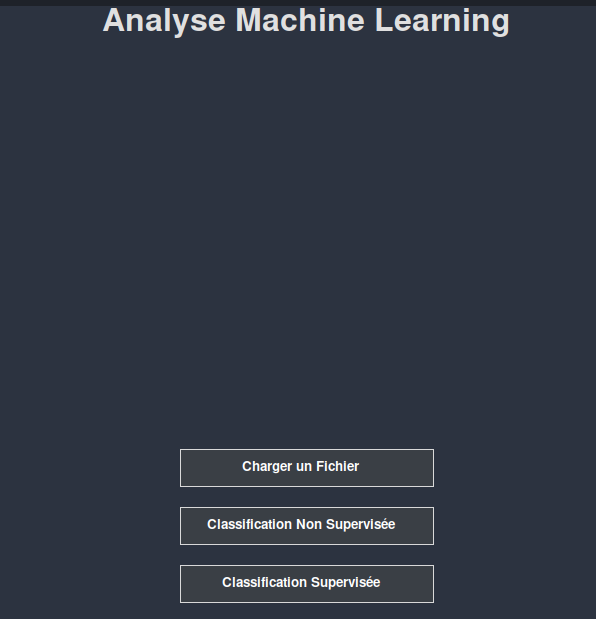
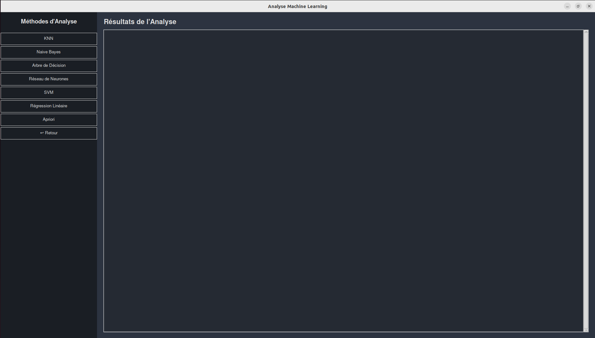

# Machine Learning Analysis Toolkit

This project is a comprehensive desktop application developed in Python with Tkinter/PyQt5, designed for data exploration and comparison of various Machine Learning algorithms. It provides an interactive platform for analyzing datasets, particularly medical data such as the *Pima Indians Diabetes* dataset.

## 📸 Screenshots


*Main application menu allowing users to load files and choose between supervised and unsupervised classification.*


*Analysis interface where users can select an algorithm and visualize results.*

## ✨ Features

The application offers a complete pipeline from data preprocessing to model evaluation.

### 1. Data Analysis and Preprocessing
- Loading data files (ARFF format)
- Exploratory data analysis: descriptive statistics, distribution visualization (Boxplots, Scatter plots)
- Preprocessing: handling missing values, data normalization (Min-Max, Z-score)

### 2. Supervised Classification Algorithms
The application implements and compares the performance of the following algorithms:
- **K-Nearest Neighbors (KNN)**
- **Gaussian Naive Bayes**
- **Decision Tree (with Gain Ratio and Gini Index)**
- **Neural Network (MLP)**
- **Support Vector Machine (SVM)** with different kernels (RBF, Linear, Polynomial)
- **Linear Regression** adapted for classification

### 3. Unsupervised Learning
- **Apriori Algorithm** for association rule discovery and risk factor identification in data

### 4. Model Evaluation
- **Comprehensive metrics:** Precision, Recall, F1-Score, and Accuracy
- **Visualization:** Confusion matrix, metric evolution curves (for KNN), and decision boundary visualization (for Linear Regression and SVM)

## 🛠️ Technologies and Libraries

- **Python 3**
- **Tkinter / PyQt5** for the graphical interface
- **Pandas** & **Numpy** for data manipulation
- **Scikit-learn** for models and metrics
- **Matplotlib** & **Seaborn** for visualizations
- **SciPy** for ARFF file loading
- **PyDotPlus** & **Graphviz** for decision tree visualization

## 🚀 How to Run

### Prerequisites

Ensure you have Python 3.7+ installed on your system.

### Installation Steps

1. **Clone the repository:**
   ```bash
   git clone https://github.com/yourusername/ML-Analysis-Toolkit-GUI.git
   cd ML-Analysis-Toolkit-GUI
   ```

2. **(Recommended) Create a virtual environment:**
   ```bash
   python -m venv venv
   # On Windows:
   .\venv\Scripts\activate
   # On macOS/Linux:
   source venv/bin/activate
   ```

3. **Install dependencies:**
   ```bash
   pip install -r requirements.txt
   ```

4. **Launch the GUI application:**
   ```bash
   python main_app.py
   ```

## 📂 Project Structure

```
ML-Analysis-Toolkit-GUI/
├── main_app.py              # Main application entry point
├── requirements.txt         # Python dependencies
├── src/
│   ├── algorithms/          # ML algorithm implementations
│   │   ├── knn.py
│   │   ├── naive_bayes.py
│   │   ├── decision_tree.py
│   │   ├── neural_network.py
│   │   ├── svm.py
│   │   └── linear_regression.py
│   ├── preprocessing/       # Data preprocessing modules
│   │   ├── data_loader.py
│   │   ├── data_cleaner.py
│   │   └── normalizer.py
│   ├── visualization/       # Visualization modules
│   │   ├── plots.py
│   │   └── metrics_viz.py
│   └── gui/                # GUI components
│       ├── main_window.py
│       ├── analysis_window.py
│       └── results_window.py
├── data/                   # Sample datasets
│   └── pima_diabetes.arff
├── docs/                   # Documentation and screenshots
│   ├── images/
│   └── user_guide.md
├── tests/                  # Unit tests
├── Rapport_Projet_ML.pdf   # Complete project report
└── README.md              # This file
```

## 🔧 Usage Guide

### 1. Loading Data
- Launch the application using `python main_app.py`
- Click "Load File" to import your ARFF dataset
- The application will automatically perform initial data analysis

### 2. Data Preprocessing
- Choose from various preprocessing options:
  - Handle missing values (mean, median, mode imputation)
  - Normalize data (Min-Max scaling, Z-score normalization)
  - Feature selection and engineering

### 3. Algorithm Selection
- Navigate to the analysis window
- Select from available algorithms:
  - **Supervised Learning:** KNN, Naive Bayes, Decision Tree, Neural Network, SVM, Linear Regression
  - **Unsupervised Learning:** Apriori algorithm for association rules

### 4. Model Training and Evaluation
- Configure algorithm parameters through the GUI
- Train the selected model on your dataset
- View comprehensive evaluation metrics and visualizations

### 5. Results Visualization
- Confusion matrices for classification performance
- ROC curves and precision-recall curves
- Decision boundary plots (where applicable)
- Feature importance analysis

## 🎯 Algorithm Implementations

### Supervised Learning

#### K-Nearest Neighbors (KNN)
- Configurable K values
- Distance metrics (Euclidean, Manhattan, Minkowski)
- Performance visualization with varying K values

#### Support Vector Machine (SVM)
- Multiple kernel support (RBF, Linear, Polynomial)
- Hyperparameter tuning interface
- Decision boundary visualization

#### Neural Networks (MLP)
- Customizable network architecture
- Training progress monitoring
- Activation function selection

#### Decision Trees
- Splitting criteria (Gini Index, Gain Ratio)
- Tree pruning options
- Visual tree representation

### Unsupervised Learning

#### Apriori Algorithm
- Association rule mining
- Support and confidence thresholds
- Risk factor identification in medical data

## 📊 Evaluation Metrics

The toolkit provides comprehensive model evaluation:

- **Classification Metrics:**
  - Accuracy
  - Precision
  - Recall
  - F1-Score
  - Specificity
  - Sensitivity

- **Visualization Tools:**
  - Confusion Matrix
  - ROC Curve
  - Precision-Recall Curve
  - Learning Curves
  - Feature Importance Plots

## 🔍 Data Analysis Features

### Exploratory Data Analysis
- Statistical summaries
- Distribution analysis
- Correlation matrices
- Missing value detection
- Outlier identification

### Data Preprocessing
- Missing value imputation
- Feature scaling and normalization
- Categorical variable encoding
- Feature selection techniques

## 🎨 GUI Features

- **User-Friendly Interface:** Intuitive design with clear navigation
- **Real-Time Updates:** Live visualization of training progress
- **Interactive Plots:** Clickable charts and graphs
- **Export Functionality:** Save results and visualizations
- **Theme Support:** Light and dark mode options

## 🚀 Advanced Features

- **Model Comparison:** Side-by-side algorithm performance comparison
- **Cross-Validation:** K-fold cross-validation implementation
- **Hyperparameter Tuning:** Grid search and random search options
- **Batch Processing:** Analyze multiple datasets simultaneously
- **Export Reports:** Generate comprehensive analysis reports

## 🧪 Testing

Run the test suite to ensure everything is working correctly:

```bash
# Run all tests
python -m pytest tests/

# Run specific test modules
python -m pytest tests/test_algorithms.py
python -m pytest tests/test_preprocessing.py
```

## 🤝 Contributing

1. Fork the repository
2. Create a feature branch (`git checkout -b feature/AmazingFeature`)
3. Commit your changes (`git commit -m 'Add some AmazingFeature'`)
4. Push to the branch (`git push origin feature/AmazingFeature`)
5. Open a Pull Request

### Development Guidelines
- Follow PEP 8 style guidelines
- Add unit tests for new features
- Update documentation for API changes
- Use descriptive commit messages

## 🔧 Requirements

### System Requirements
- Python 3.7 or higher
- Windows 10/macOS 10.14/Ubuntu 18.04 or later
- Minimum 4GB RAM recommended
- 1GB free disk space

### Python Dependencies
```
tkinter>=8.6
pandas>=1.3.0
numpy>=1.21.0
scikit-learn>=1.0.0
matplotlib>=3.4.0
seaborn>=0.11.0
scipy>=1.7.0
pydotplus>=2.0.2
graphviz>=0.17
```

## 🐛 Troubleshooting

### Common Issues

1. **Graphviz Installation:**
   ```bash
   # Windows (using conda)
   conda install graphviz
   
   # macOS
   brew install graphviz
   
   # Ubuntu
   sudo apt-get install graphviz
   ```

2. **ARFF File Loading Issues:**
   - Ensure your ARFF file follows the standard format
   - Check for special characters in attribute names
   - Verify data type consistency

3. **Memory Issues with Large Datasets:**
   - Consider data sampling for initial analysis
   - Use chunked processing for very large files
   - Monitor memory usage during processing


## 🌟 Star History

If you find this project helpful, please consider giving it a star! ⭐

---

This comprehensive Machine Learning Analysis Toolkit demonstrates advanced skills in data science, software engineering, and GUI development, making it an excellent addition to any data science portfolio.
